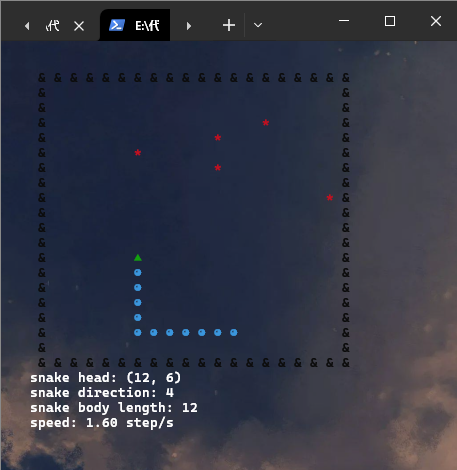
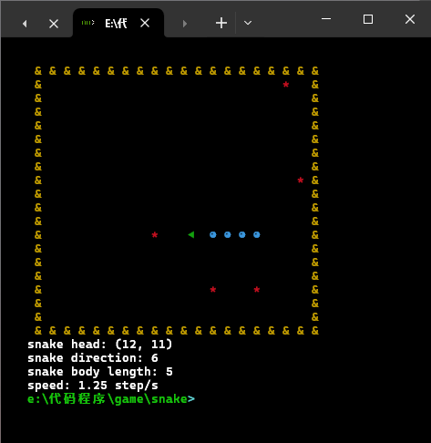

# **游戏介绍**:

## **游戏截图**
- ### 运行游戏后，游戏界面如下：
- 
- 

## **运行条件**
- 测试环境 
    - win10 64位,Python 3.7, 测试终端为 cmd、unshell、powershell。

## **游戏规则**
- 游戏地图由n*n的格子组成的围墙构成。
- 地图中随机生成5个`*`形食物。
- 吃到食物，蛇的长度增加1。    

## **操作说明**
- 在终端文件目录下运行 `python game.py`
- 蛇的初始位置在左上角,方向向右
- 蛇的运动方向由键盘控制, 按下W键向上, S键向下, A键向左, D键向右.
- 按q键可结束游戏。
- 当蛇撞到障碍物, 游戏结束。

## **等待增加**:
- ~~限制反向掉头。蛇居然可以反向吃掉自己，这非常的不合逻辑。~~
- 增加加速机制
- 增加暂停功能
- 添加开始界面
- 添加设置界面
- 添加重新开始功能
- 增加游戏难度设置
- 设计地图功能
- 简化代码
- 添加双人模式
- 添加联网模式

## **bug**:
- ~~蛇身碰撞未异常。~~
- 初始化界面功能存在问题，该问题会将界面所有信息清除的逻辑，这非常不适合摸鱼。
- ~~碰撞墙体会增加显示蛇身长度，吃自己也会增加显示蛇身长度。~~
- 食物显示不合理，蛇身会覆盖到食物。

## **log**:
- 2024年7月20日03:07:33: 修正蛇身碰撞判断。
- 2024年7月20日03:45:32: 增加限制反向掉头。修复接触墙体、自食会增加显示长度的问题。
